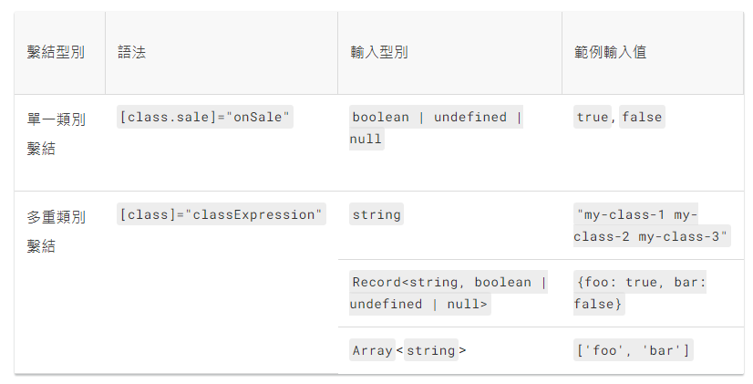
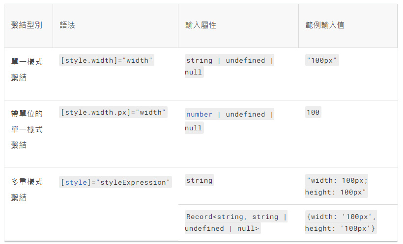

[動態組件 - ComponentFactory](/_IO0ztO2Qsafvg_IEgihxg)

## 使用 CLI 創建

```bash
ng generate component <component-name>
```

創建`<component-name>`資料夾，包含以下檔案: (建立的方式可更動)

- 類別檔案:`<component-name>.component.ts`
- css 樣式檔案:`<component-name>.component.css`
- html 模板檔案(範本):`<component-name>.component.html`
- 測試檔案:`<component-name>.component.spec.ts`

> 創建的這些檔案，共同定義了這元件，在 Angular 中稱為「view」

並更改`app.module.ts`, 在`@NgModule`中`declarations`中宣告它。

## `@Component`裝飾器

[@Component 官方文件](https://angular.tw/api/core/Component)

- 普通的類別，加上`@Component`裝飾器才是 Angular 元件
- 在裝飾器裡面定義 metadata，它告訴 Angular 組件主要構成要素

### metadata

以下為常見的 metadata 配置選項:

- **changeDetection**: 變更檢測策略
  - Default:
    假設`@Input()`項是物件，裡面的屬性有改動，就會觸發變更檢測，極盡可能只要有變更就觸發
  - onPush:
    假設`@Input()`項是物件，必須要參考也變動，才會觸發
- **selector** : css 選擇器，告知在哪個 html 元素實例該組件
- **templateUrl | template** : 指定 html 文件或直接鍵入 html，tells Angular how to render the component
- **providers** : 用陣列形式表示該組件所需服務

## 資料繫結

[官方文件](https://angular.tw/guide/architecture-components#data-binding)

## 屬性繫結 Attribute

可以繫結 Property，就不要選擇 Attribute。但有時我們還是需要 Attribute ～沒錯。
ex. (官方特別指出，真的別無他法的那些時刻，他們根本沒有 Property！)

- ARIA
- SVG

### 基本的語法

```html
<div [attr.aria-label]="name"></div>
```

屬性名稱前面加上 `attr.`

### 常見用例

- class



- style



## 屬性繫結 property binding


### 父給子

```html
<!----父組件template中---->
<app-hero-detail [hero]="selectedHero"></app-hero-detail>
```

```jsx
//in 子組件設定檔

//(1) 直接使用父組件傳來的值
@Input() hero:string|undefined;

//(2) 攔截傳來的值，使用前先做別的處理 ex.trim()
@Input()
    get hero():string {return _hero};
    set hero(hero:string){
        this._hero = (hero && hero.trim()) || '<no name set>';
    }
    private _hero = '';
```

把父組件的`selectedHero`傳到子組件的`hero` (在[]中的 hero 為目標屬性 target property，要對其賦值) (使用[]時，**Angular 將 等號右側視作動態表示式進行求值** 。不使用時，則視作字面值，直接賦字串)

### 子給父

```jsx
//in 子組件設定檔
@Output() count = new EventEmitter<boolean>();

// emit 父組件
this.count.emit([傳參數]);
```

- `@Output`屬性必須是`EventEmitter`型別，~~為 Angular 中用來 emit 自定義事件的型別 (可以想作`new EventEmitter`之後，就創建了一個可 emit 父組件該自定義事件的方法)~~ `EventEmitter`繼承了`Subject`介面，於是一個`@Output`屬性代表一個新的資料流
- `emit()`方法代表`Subject`發送通知，呼叫各`Observer`的`next()`方法
  (而這個方法是 Angular 擴充的，用來讓子元件傳送任意參數)

```
<!--in 父組件模板-->
<!--設定要接收的屬性-->
<app-son (count)="onCount($event)"></app-son>
```

- 在 Angular 中有兩種`$event`，一種是普通的 DOM 事件的 event，比如 click, keyup 等。另一種是自定義的 event，當觸發子組件傳值給父組件的`EventEmitter`，父組件就是用`$event`來接收這個值（於是自定義 event 的`$event`內容很單純，就是傳值）

### 使父組件模板中可以取用子組件的方法和屬性(本地變數 local variable, 樣本參考變數)

```
<!--in 父組件模板-->
<!--設定local variable #son，則可在父組件模板取用該子組件的屬性方法-->
<app-son #son></app-son>
```

則父組件可以在**模板**取用子組件屬性方法，侷限性在於: **父組件的類別檔中，依然無法取用子組件屬性方法**

### 使父組件類別檔中可以取用子組件的方法和屬性(ViewChild)

### 子和父使用 serve 來通訊

該服務實例的作用域被限制在父元件和其子元件內。這個元件子樹之外的元件將無法訪問該服務或者與它們通訊。

### 雙向資料繫結 Two-way data binding

### 使用`ngModel`(語法糖)

```
<input type="text" id="hero-name" [(ngModel)]="hero.name">
```

讓模板中 input field 和組件中`hero.name`雙向繫結 > 雙向繫結需引入`import { FormsModule } from '@angular/forms';`才可使用

### 不使用`ngModel`

`@Output()`的屬性名稱要和`@Input()`的相呼應。 比如若`@Input()`屬性名`size`，則`@Output()`必須是`sizeChange`。

## 生命週期鉤子

參考資料:[angular 大師之路](https://ithelp.ithome.com.tw/articles/10203203)

==創建元件(呼叫建構子)後==，照以下順序發生: - [ngOnChanges()](/UA2asj7JT4mVwOnzj1dnJg) (_Called frequently_) - 搭配`@Input()`，若無則此事件永不發生 - 可視為取得、更新`@Input()`項 - [ngOnInit()](/gHKkweymQWeukox2TF8BNA) (_只調用一次_) - 建構子(constructor)之外的初始化。適合去遠方拿資料。 - [ngDoCheck()](/KWEePC6iQpagfRRRsE-FDw) (_Called frequently_) - 每次`ngOnChanges()`(和首次`ngOnInit()`)之後觸發，僅是在 input field 改變聚焦也會觸發 - 可以檢測一些`ngOnChanges()`沒檢測到的(`ngOnChanges()`在`@Input()`變動時觸發，但若非存值，指向不變，則檢測不到) - [ngAfterContentInit()](/_rjp_O34SD-hyfOMoVtP1g) (_只調用一次_) - 使用`@ContentChild`和`@ContentChildren`查詢的內容，在此才能取得到 - 似乎用來搜查`<ng-content>`而已 - ngAfterContentChecked() (_Called frequently_) - ngAfterViewInit() - 使用`@ViewChild`和`@ViewChildren`查詢的內容，在此才能取得到 - 子組件、樣本參考變數 - ngAfterViewChecked() (_Called frequently_) - ngOnDestroy() 在實例銷毀時進行清理(ex.停止 interval, 取消訂閱 observable, 解除 listener)

## metadata

[文件](https://angular.tw/api/core/Component)

```
@Component({

})
```

## view encapsulation

可選如何封裝組件的 css: (進出是指全域樣式和組件的關係) - ShadowDom(不進不出) - Emulated(只進不出)(預設) - None(可進可出)

### 設定範例

```
encapsulation: ViewEncapsulation.ShadowDom
```

## 樣式

`@Component`的 metadata 定義的樣式，只有該元件會吃到，嵌入他的元件和內容投影(content projected, 如 ng-content)嵌進來的元件都不會繼承那些樣式

元件可能吃到的樣式(目前無順序):

- 自己 metadata 中定義的樣式

- 自己範本中的`<style>`、`<link>`tag

- 內嵌的元件的 metadata 中，指定`:host`選擇器的樣式

- `angular.json`中的全域樣式

### `:host`

用途: 去指定宿主元件的樣式 使用方式是把`:host`當成方法一樣，後面接一個小括號，把其餘選擇器放在裡面

```
:host(.active){
    border-width: 3px;
}
```

### `:host-context`

用途:當祖先元素的樣式符合條件，就應用某些樣式

```
:host-context(.theme-light) h2 {
  background-color: #eef;
}
```

### `::ng-deep`

用途: 此樣式不會被封裝

(比方說組件 A 的樣式用了 `::ng-deep` ，所有把組件 A 嵌入的組件，都會應用到此樣式 )

(此樣式會直接出現在 `<header>` 的 `<style>` 裡面

### @Hostbinding()

常用在指令

可以幫宿主元素加上 dom property(我也不確定是啥 ...但已知 class, style 皆可 ...)

### @Attribute

> 請記住，要持續追蹤 Attribute 的值並更新關聯的 Property 時，請使用  [@Input()](https://angular.tw/api/core/Input)。若要將 HTML 屬性的值注入到元件或指令的建構函式中，請使用[ @Attribute()](https://angular.tw/api/core/Attribute)。
